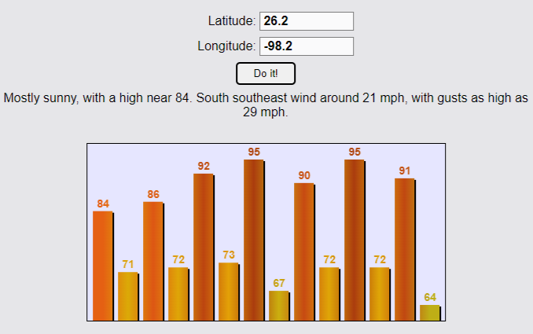

# Weather Forecast App

This repo houses an easy-to-use app which gives the weekly weather forecast for any latitude 
and longitude coordinates and draws a temperature graph based on the forecast.

I used this codebase to explore fetching from APIs and graphics. It's a simple website that was mainly meant to allow me to explore using vanilla JS. I used fetch to consume [weather.gov](https://www.weather.gov/) API and JS canvas for the temperature graphing. I also used the graph to experiment with different gradients and simple canvas effects.

## Reading the Code

Weather.JS:
- `getPicture` reads the latitude and longitude input and outputs the day's forecast
- `TEMP_GRADIENT` is a list of JS objects that contain RGB values for specific temperatures
- `getTempFromGradient` uses `TEMP_GRADIENT` to create an RGB value for a temperature
- `drawTemp` draws the forecast graph on the canvas